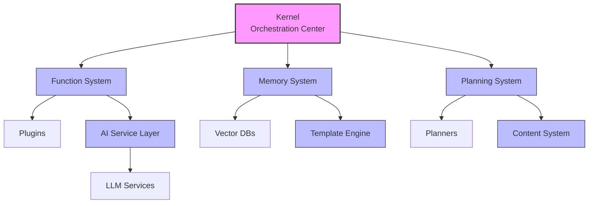

# Semantic Kernel Python Documentation

This repository contains comprehensive architecture documentation for the Python implementation of Microsoft's Semantic Kernel.

## Documentation Structure

- [Architecture Documentation](/architecture/): Complete architectural overview and detailed component documentation
  - [Architecture Overview](/architecture/overview.md): Core concepts, principles, and high-level architecture
  - [Component Architecture](/architecture/components.md): Detailed component documentation with class diagrams
  - [Data Flow Architecture](/architecture/data_flow.md): Key data flows and state management
  - [Extension Points](/architecture/extension_points.md): Plugin system and other extension mechanisms
  - [Integration Patterns](/architecture/integration_patterns.md): Patterns for integrating with various systems

## Purpose

This documentation provides a clear understanding of the Python implementation of Semantic Kernel, focusing on:

1. **System Architecture**: The overall structure and organization of the framework
2. **Component Relationships**: How different parts of the system interact
3. **Data Flows**: How information moves through the system
4. **Integration Patterns**: How to integrate with AI services and other systems
5. **Extension Points**: How to customize and extend the framework

## Key Architecture Diagram

## Highlighted Features

- **Modular Architecture**: Highly modular design with loosely coupled components
- **Multiple AI Service Support**: Compatible with OpenAI, Azure OpenAI, Anthropic, and others
- **Memory System**: Semantic memory with multiple vector database options
- **Planning System**: Automated planning for complex task orchestration
- **Plugin Architecture**: Extensible plugin system for adding custom functionality
- **Filter Pipeline**: Customizable pipeline for cross-cutting concerns

## Getting Started

To understand the architecture, start with the [Architecture Overview](/architecture/overview.md) and then explore the detailed component documentation as needed.

## Related Resources

- [Semantic Kernel Repository](https://github.com/microsoft/semantic-kernel)
- [Official Documentation](https://learn.microsoft.com/en-us/semantic-kernel/overview/)
- [Python Samples](https://github.com/microsoft/semantic-kernel/tree/main/python/samples)