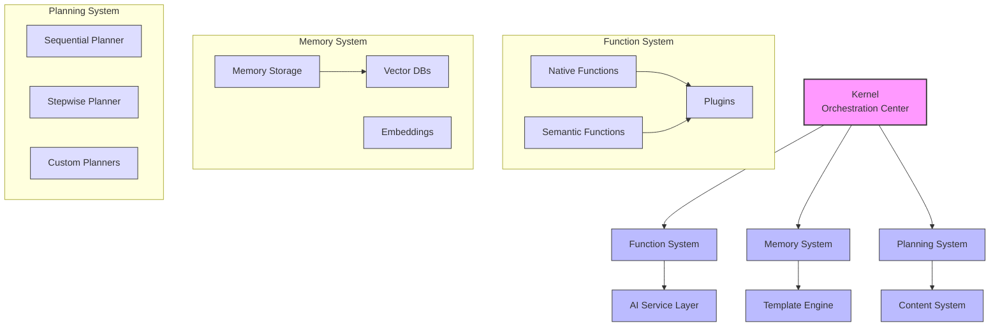

# Semantic Kernel Python Architecture Documentation

This directory contains comprehensive architecture documentation for the Python implementation of Microsoft's Semantic Kernel.

## Table of Contents

1. [Architecture Overview](overview.md)
   - Core concepts and architectural principles
   - High-level architecture diagram
   - System boundaries and external dependencies
   - Key dependencies and deployment models

2. [Component Architecture](components.md)
   - Detailed documentation of core components
   - Component relationships and dependencies
   - Class diagrams for major components
   - Extension points overview

3. [Data Flow Architecture](data_flow.md)
   - Key data structures and models
   - Function invocation flow
   - Chat completion flow
   - Memory operations flow
   - Prompt rendering and planning flows
   - State management approaches

4. [Extension Points](extension_points.md)
   - Plugin architecture with examples
   - Custom AI service integration
   - Custom memory connectors
   - Custom planners
   - Filter pipeline for cross-cutting concerns
   - Template engine extensibility
   - Integration patterns

5. [Integration Patterns](integration_patterns.md)
   - LLM integration patterns (OpenAI, Azure, Anthropic)
   - Memory integration with vector databases
   - Web framework integration
   - Asynchronous processing integration
   - Streaming integration
   - Data processing integration
   - MCP integration
   - Containerization and deployment

## Overview

Semantic Kernel is an open-source framework designed to integrate Large Language Models (LLMs) with conventional programming languages. The Python implementation of Semantic Kernel provides a structured approach to building AI-powered applications by combining the capabilities of LLMs with traditional software development patterns.

The architecture documentation is organized to provide both a high-level overview and detailed explanations of specific components and their interactions. Whether you're new to Semantic Kernel or looking to extend its functionality, these documents provide the necessary background and technical details.

## Architecture Diagram

## Key Insights

This architecture documentation highlights several key insights about Semantic Kernel Python:

1. **Modular Design**: Semantic Kernel is built with a highly modular architecture, allowing components to be used independently or combined as needed.

2. **Extensibility**: The framework provides multiple extension points for customizing behavior and integrating with external systems.

3. **Asynchronous First**: The architecture is designed with asynchronous operations throughout, leveraging Python's async/await capabilities.

4. **Provider Agnostic**: The framework abstracts AI provider details, allowing applications to work with multiple AI services interchangeably.

5. **Composition Pattern**: Functions can be composed into complex workflows, either manually or through planners.

6. **Filter Pipeline**: The architecture uses a filter pipeline pattern for cross-cutting concerns like logging, validation, and error handling.

## Getting Started

If you're new to Semantic Kernel Python, we recommend starting with the [Architecture Overview](overview.md) to understand the core concepts and principles, then exploring the [Component Architecture](components.md) to learn about the key components and their relationships.

For developers looking to extend Semantic Kernel, the [Extension Points](extension_points.md) document provides detailed guidance on the available extension mechanisms.

## Related Resources

- [Semantic Kernel Python Documentation](https://github.com/microsoft/semantic-kernel/tree/main/python)
- [Semantic Kernel Python Samples](https://github.com/microsoft/semantic-kernel/tree/main/python/samples)
- [Semantic Kernel Website](https://learn.microsoft.com/en-us/semantic-kernel/overview/)