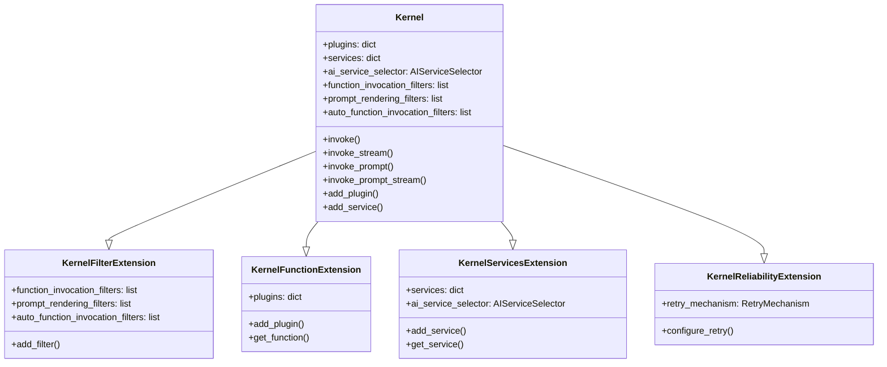
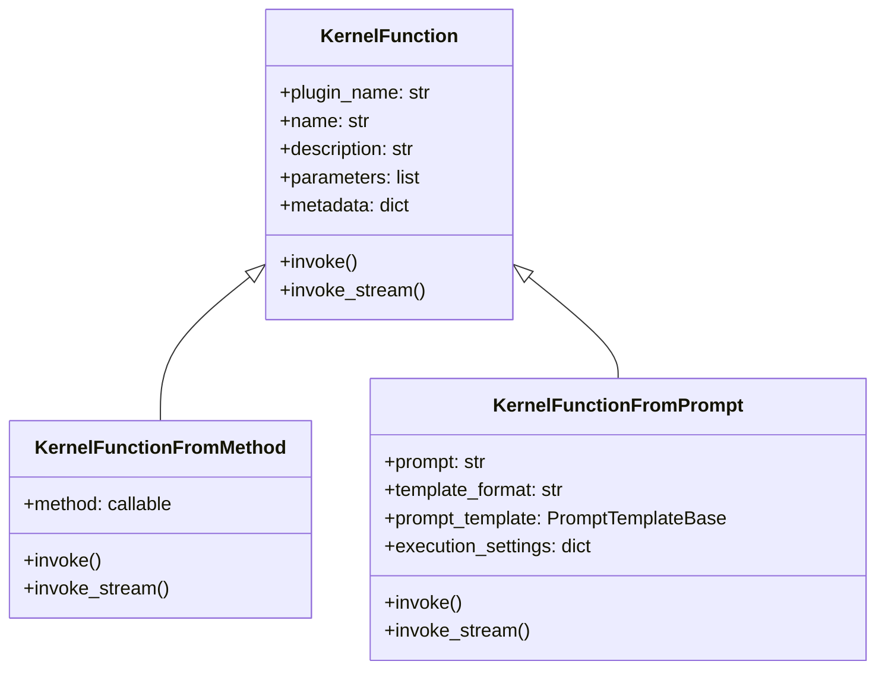
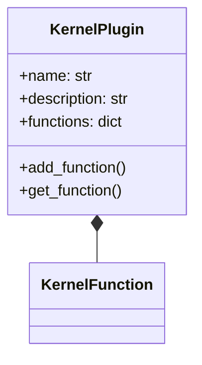
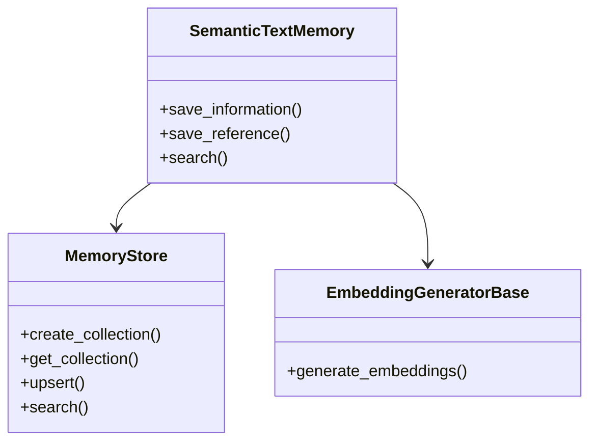
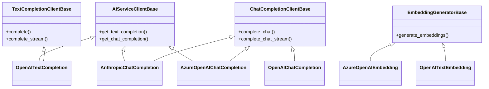
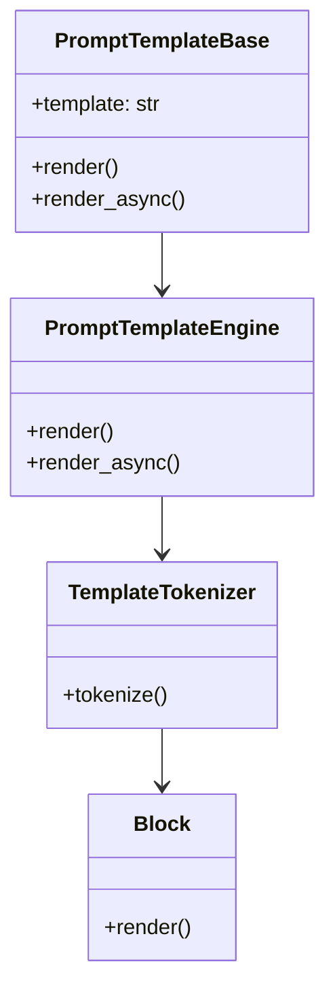
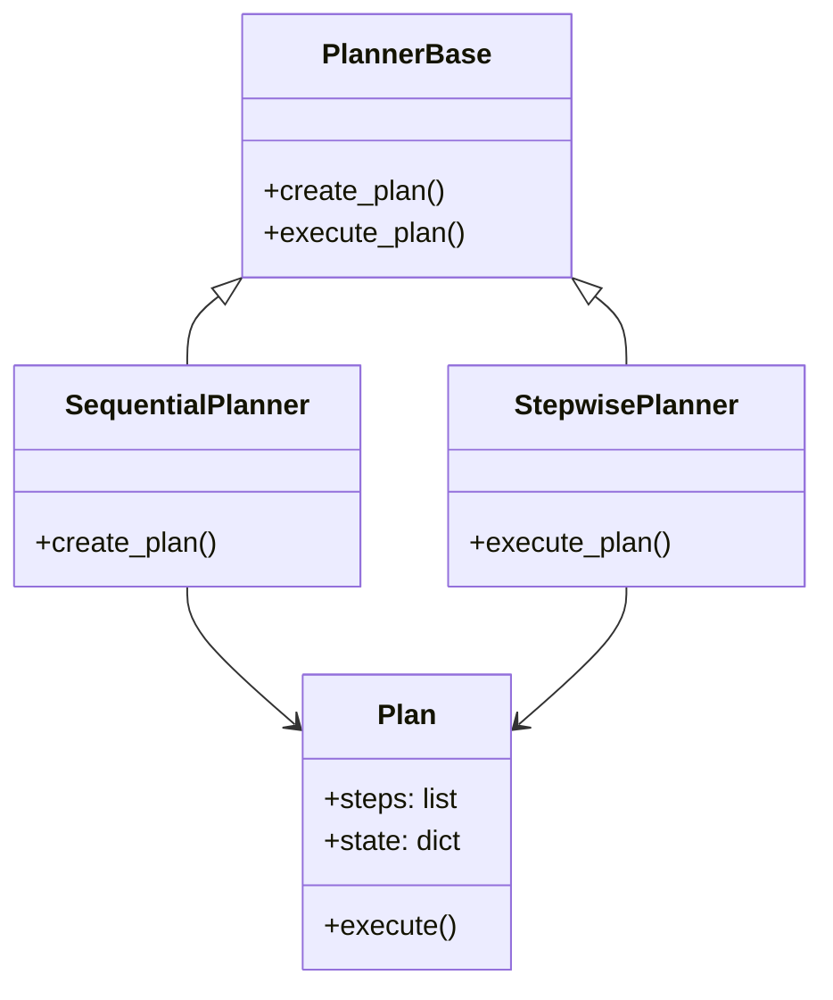
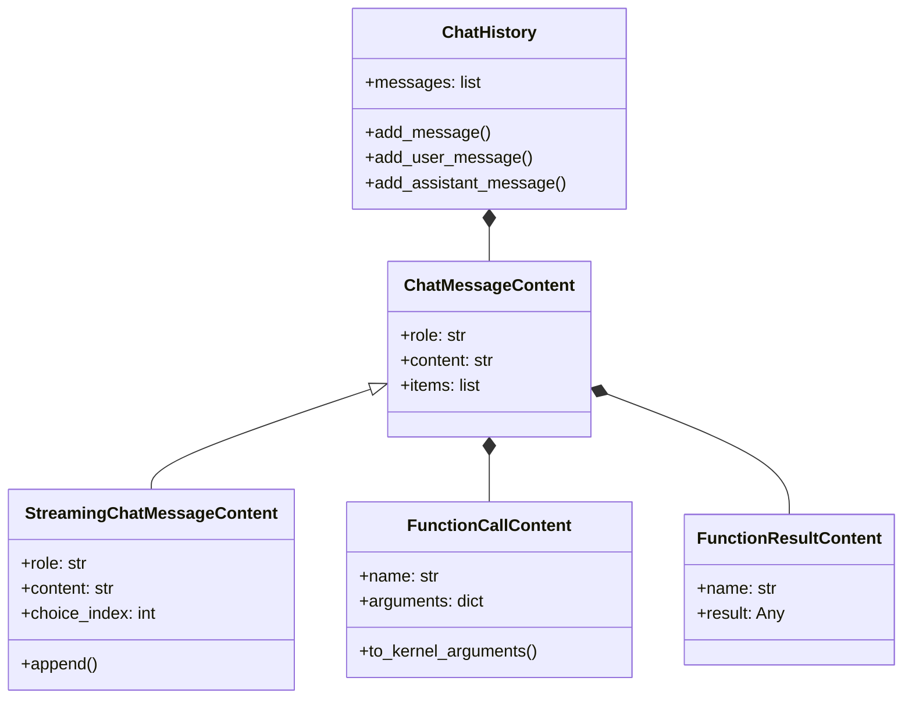
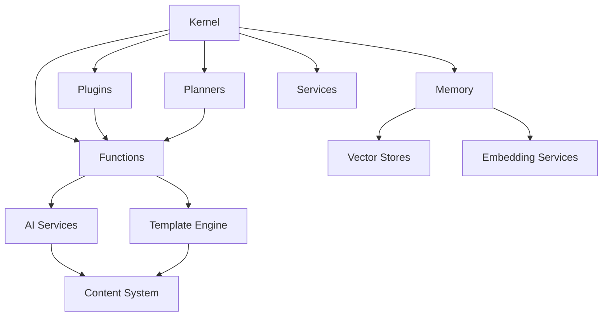

# Semantic Kernel Python: Component Architecture

## Introduction

This document describes the key components of the Semantic Kernel Python implementation, their responsibilities, relationships, and interactions. Understanding these components is essential for effectively working with and extending the framework.

## Core Components

Semantic Kernel Python is organized into several core components, each with specific responsibilities and interfaces.

### Kernel

**Purpose**: Central orchestration point that manages plugins, services, and function execution.

**Key Responsibilities**:
- Register and manage plugins and functions
- Manage AI service clients
- Provide function invocation pipeline
- Coordinate interaction between components
- Manage memory services

**Key Interfaces**:
- `invoke()`: Execute functions
- `invoke_stream()`: Execute functions with streaming responses
- `invoke_prompt()`: Create and execute functions from prompts
- `add_plugin()`: Register plugins with the kernel

**Component Diagram**:

### Functions

**Purpose**: Encapsulate executable units of work, whether code-based or AI-based.

**Types**:
- **KernelFunction**: Base class for all functions
- **KernelFunctionFromMethod**: Wraps Python methods as functions
- **KernelFunctionFromPrompt**: Creates functions from prompt templates

**Key Responsibilities**:
- Execute business logic
- Interact with AI services
- Process inputs and produce outputs
- Define parameter requirements

**Key Interfaces**:
- `invoke()`: Execute the function
- `invoke_stream()`: Execute with streaming results

**Component Diagram**:

### Plugins

**Purpose**: Organize related functions into cohesive units that can be registered with the kernel.

**Key Responsibilities**:
- Contain related functions
- Provide domain-specific functionality
- Enable discovery and registration of functions

**Key Interfaces**:
- KernelPlugin: Container for functions

**Component Diagram**:

### Memory

**Purpose**: Provide storage and retrieval of information with semantic search capabilities.

**Key Components**:
- Memory stores (semantic memory)
- Collection management
- Embedding services

**Key Interfaces**:
- `save_information()`: Store information
- `search()`: Search for relevant information
- `save_reference()`: Store references to information

**Component Diagram**:

### Connectors

**Purpose**: Interface with external services and systems.

**Types**:
- **AI Connectors**: Connect to AI services (OpenAI, Azure, etc.)
- **Memory Connectors**: Connect to vector databases
- **Search Connectors**: Connect to search engines

**Key Responsibilities**:
- Abstract external service details
- Handle authentication and communication
- Convert between SK formats and external formats

**Component Diagram**:

### Template Engine

**Purpose**: Process prompt templates with variable substitution.

**Key Responsibilities**:
- Parse prompt templates
- Resolve variables in templates
- Support different template formats

**Key Components**:
- PromptTemplateEngine
- Template blocks and variables

**Component Diagram**:

### Planners

**Purpose**: Orchestrate function execution to achieve complex goals.

**Types**:
- **Sequential Planner**: Creates a sequence of steps
- **Stepwise Planner**: Dynamically determines next steps

**Key Responsibilities**:
- Create execution plans
- Determine functions to call
- Handle execution flow

**Component Diagram**:

### Content System

**Purpose**: Manage and manipulate content structures for interaction with AI services.

**Key Components**:
- ChatMessage
- ChatHistory
- StreamingContent

**Key Responsibilities**:
- Represent chat messages and conversations
- Handle streaming content
- Support function calls and results

**Component Diagram**:

## Component Relationships

The following diagram illustrates the key relationships between Semantic Kernel Python components:

## Extension Points

Semantic Kernel Python is designed to be extensible at multiple levels:

1. **Custom Functions**: Create native functions by implementing the `KernelFunction` interface
2. **Custom Plugins**: Create plugins by grouping related functions
3. **Custom AI Connectors**: Implement `AIServiceClientBase` to connect to new AI services
4. **Custom Memory Connectors**: Implement `MemoryStore` for new vector databases
5. **Custom Planners**: Extend `PlannerBase` to create new planning strategies
6. **Custom Filters**: Implement function invocation filters to intercept and modify function execution

## Conclusion

The component architecture of Semantic Kernel Python provides a flexible and extensible foundation for building AI-powered applications. By understanding these components and their relationships, developers can effectively use and extend the framework to meet their specific needs.

The modular design allows for replacing or extending individual components without affecting the entire system, making it adaptable to a wide range of use cases and integration scenarios.