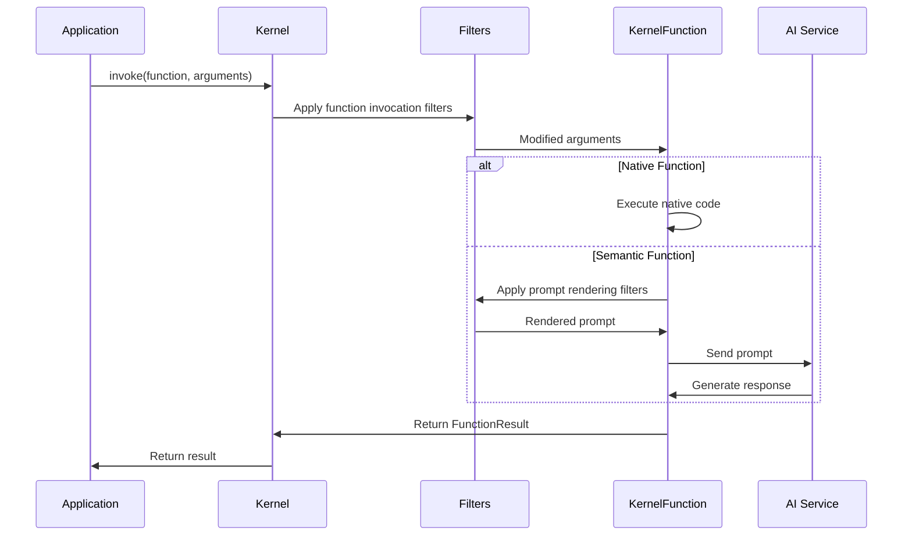
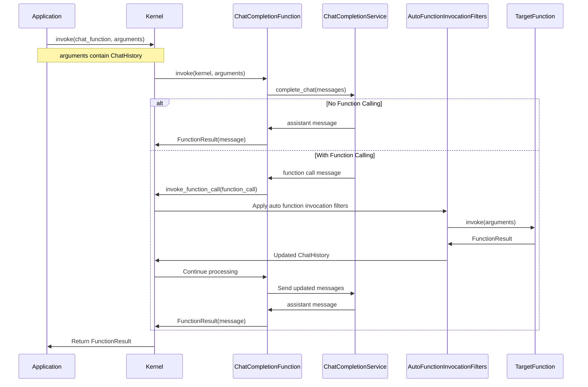
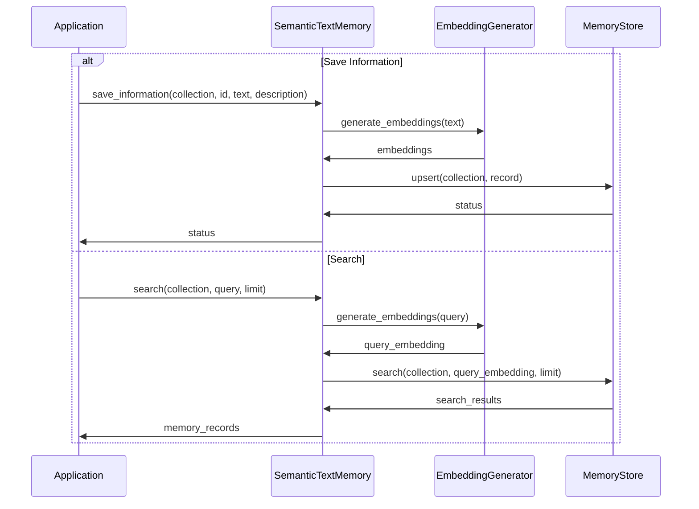
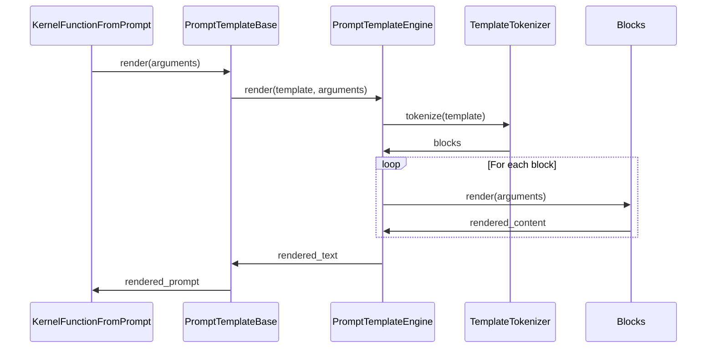
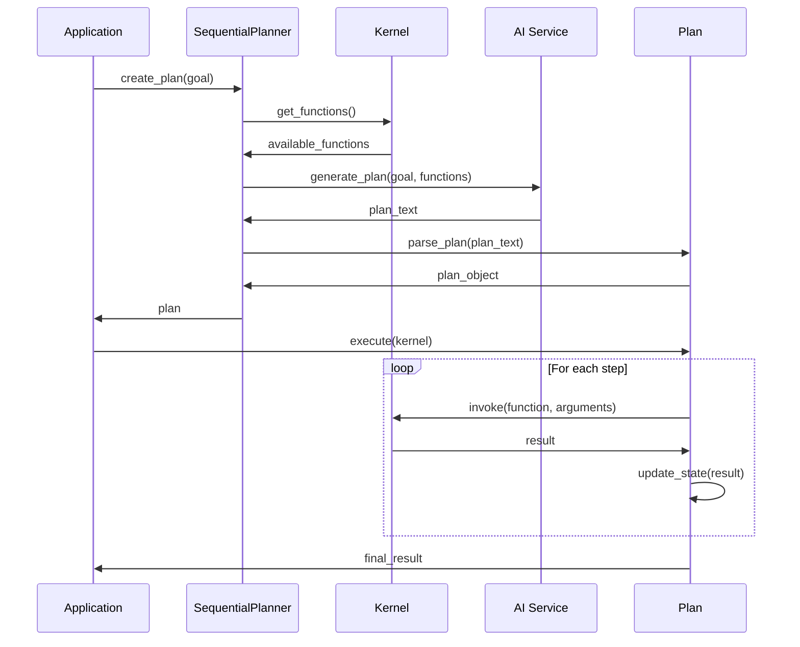
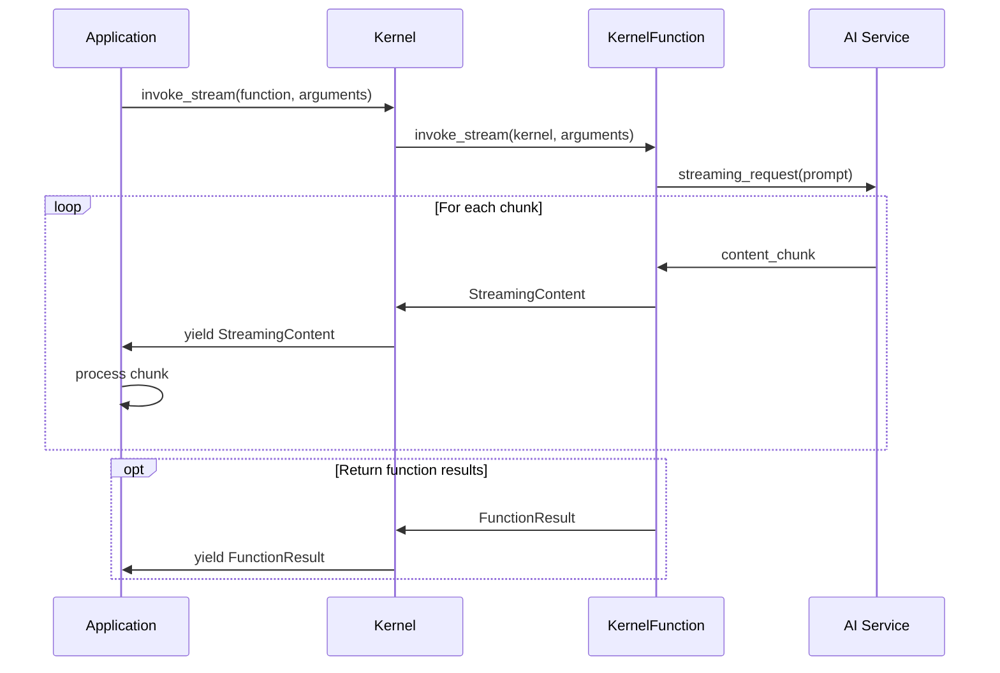

# Semantic Kernel Python: Data Flow Architecture

## Introduction

This document describes how data flows through the Semantic Kernel Python system during key operations. Understanding these data flows is crucial for effective use, debugging, and extension of the framework.

## Key Data Structures

Semantic Kernel Python uses several core data structures to move information through the system:

### KernelArguments

**Purpose**: Carries input and output data between functions and components.

**Structure**:
```python
class KernelArguments(dict):
    # Dictionary-like structure with additional methods
    def update(self, other_dict=None, **kwargs): ...
    def read(self, key, default_value=None): ...
    def add(self, key, value): ...
```

**Usage**:
- Passed to functions during invocation
- Modified and passed between chained function calls
- Used to pass execution context and state

### FunctionResult

**Purpose**: Contains the result of function execution.

**Structure**:
```python
class FunctionResult:
    function: dict  # Metadata about the function
    value: Any      # The result value
    metadata: dict  # Additional metadata about the execution
```

**Usage**:
- Returned from function invocations
- Contains both the result value and metadata about the execution
- Used in function chains and planners

### ChatMessageContent & ChatHistory

**Purpose**: Represent chat messages and conversation history.

**Structure**:
```python
class ChatMessageContent:
    role: str       # Role of the message sender (user, assistant, system)
    content: str    # Text content
    items: list     # Additional message items (like function calls)

class ChatHistory:
    messages: list[ChatMessageContent]  # List of messages
```

**Usage**:
- Passed to and from chat completion services
- Tracks conversation context
- Includes function calls and results

### StreamingContentMixin

**Purpose**: Enables streaming responses from functions.

**Structure**:
```python
class StreamingContentMixin:
    # Base streaming functionality
    choice_index: int  # Index of this content in choices
    
    def __iadd__(self, other): ...  # Append content
```

**Usage**:
- Base for streaming chat responses
- Allows incremental content updates
- Supports multiple choice responses

## Function Invocation Flow

The following diagram illustrates the data flow during function invocation:



### Data Transformation During Function Invocation:

1. **Input Preparation**:
   - Application creates `KernelArguments` with input data
   - Kernel passes arguments to function invocation filters

2. **Function Execution**:
   - For native functions:
     - Arguments are passed to the Python method
     - Method executes and returns a result
   - For semantic functions:
     - Arguments are used to render the prompt template
     - Rendered prompt is sent to AI service
     - AI service response is captured

3. **Result Processing**:
   - Function creates a `FunctionResult` with the execution result
   - Result is returned through the kernel to the application

## Chat Completion Flow

The following diagram illustrates the data flow during chat completion:



### Data Transformation During Chat Completion:

1. **Input Preparation**:
   - Application creates or updates `ChatHistory`
   - Chat history is passed in `KernelArguments`

2. **Chat Completion**:
   - Chat history is converted to AI service format
   - Sent to the chat completion service
   - Service generates response or function call

3. **Function Calling (if applicable)**:
   - Function call is extracted from AI response
   - Arguments parsed into `KernelArguments`
   - Target function is invoked
   - Result is formatted and added to chat history
   - Updated history is sent back to AI service

4. **Result Processing**:
   - Final chat response is wrapped in `FunctionResult`
   - Result is returned to the application

## Memory Operations Flow

The following diagram illustrates the data flow during memory operations:



### Data Transformation During Memory Operations:

1. **Saving Information**:
   - Text is converted to embeddings via embedding service
   - Embeddings and metadata are packaged into memory record
   - Record is stored in memory store with collection and ID

2. **Searching**:
   - Query text is converted to embeddings
   - Embeddings are used to search the vector store
   - Similar items are retrieved based on vector similarity
   - Results are converted to memory records and returned

## Prompt Rendering Flow

The following diagram illustrates the data flow during prompt template rendering:



### Data Transformation During Prompt Rendering:

1. **Template Preparation**:
   - Template text is tokenized into blocks
   - Blocks identify variables, code, and text sections

2. **Variable Resolution**:
   - Variables in template are resolved from `KernelArguments`
   - Nested variable references are resolved recursively

3. **Block Rendering**:
   - Each block type renders its content
   - Text blocks remain unchanged
   - Variable blocks are replaced with values
   - Code blocks are executed and results inserted

4. **Result Assembly**:
   - Rendered blocks are concatenated
   - Complete prompt is returned for use with AI services

## Planning Flow

The following diagram illustrates the data flow during planning with the Sequential Planner:



### Data Transformation During Planning:

1. **Plan Creation**:
   - Goal is combined with available functions
   - AI service generates a plan in structured text format
   - Text is parsed into executable plan steps

2. **Plan Execution**:
   - Each step specifies a function and arguments
   - Function is invoked with provided arguments
   - Results are captured and used in subsequent steps
   - State is maintained and passed between steps

3. **Result Processing**:
   - Final step result becomes the plan result
   - Plan state captures the execution history
   - Final result is returned to the application

## Streaming Data Flow

The following diagram illustrates the data flow during streaming function execution:



### Data Transformation During Streaming:

1. **Stream Initiation**:
   - Kernel initiates streaming invocation
   - Function connects to streaming-capable AI service
   - Streaming connection is established

2. **Chunk Processing**:
   - AI service generates content in small chunks
   - Each chunk is wrapped in `StreamingContentMixin` object
   - Chunks are yielded through the kernel to the application
   - Application processes chunks as they arrive

3. **Stream Completion**:
   - After all chunks are processed, the function result is optionally returned
   - Application has received the complete content incrementally

## State Management

Semantic Kernel Python manages state in several ways:

1. **Kernel State**:
   - Registered plugins and functions
   - Registered AI services
   - Registered filter pipelines

2. **Execution State**:
   - `KernelArguments` for passing state between functions
   - `ChatHistory` for maintaining conversation context
   - Plan state for multi-step execution

3. **Memory State**:
   - Persistent storage in vector databases
   - Memory records with metadata
   - Semantic search capabilities

## Conclusion

The data flow architecture of Semantic Kernel Python demonstrates how information moves through the system during various operations. Understanding these flows helps developers effectively use the framework, troubleshoot issues, and create custom extensions.

Key patterns in the data flow architecture include:

1. **Transformation Pipeline**: Data undergoes transformations as it passes through components
2. **Filter Chain Pattern**: Modifiable pipeline of filters for pre/post-processing
3. **Asynchronous Processing**: Async operations throughout for performance
4. **Component Composition**: Data flows between loosely coupled components
5. **State Isolation**: Clear boundaries for state management

These patterns provide the flexibility needed for a wide range of AI application scenarios while maintaining a consistent and predictable programming model.