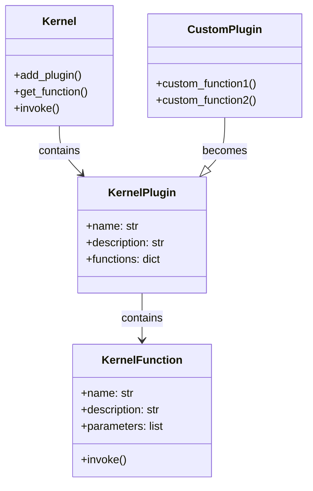
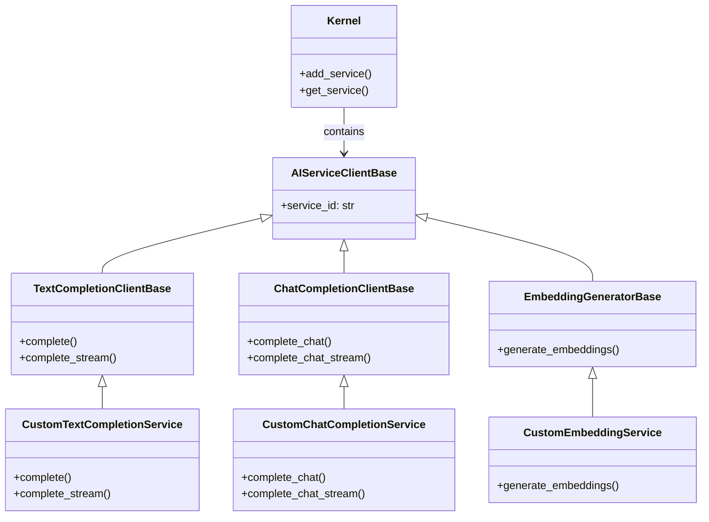
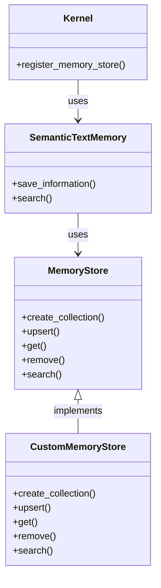
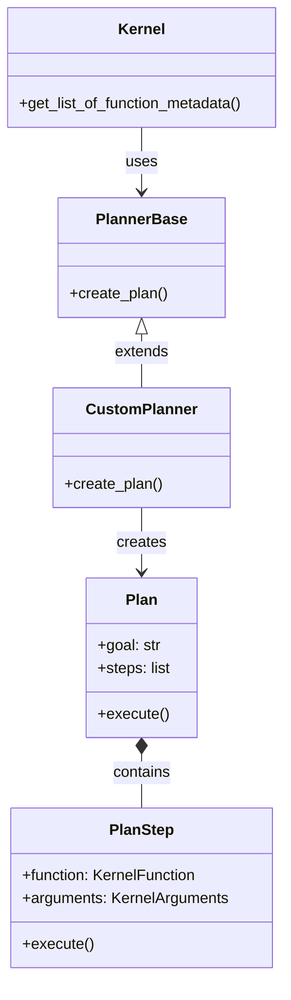
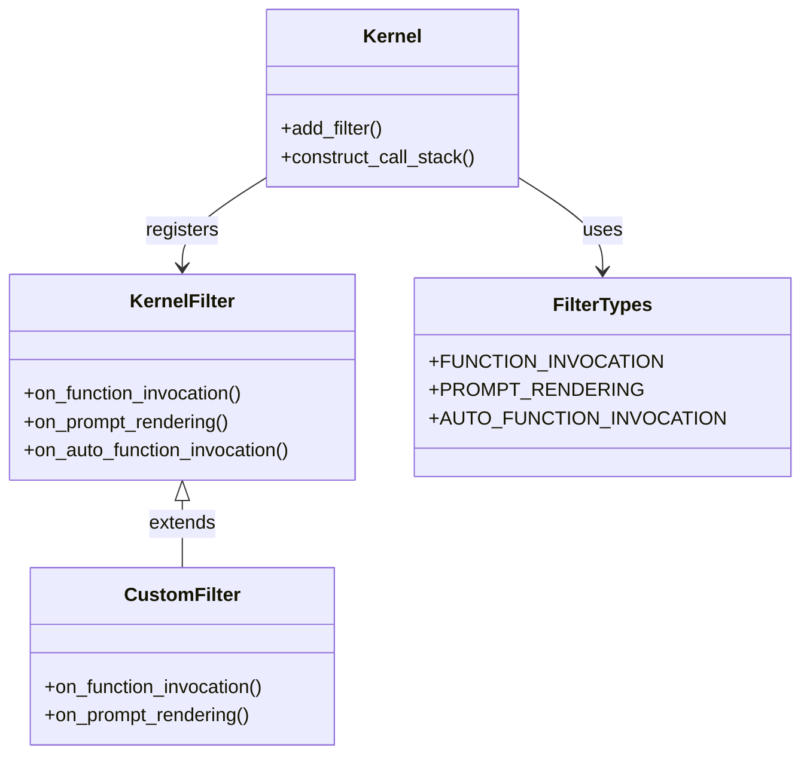
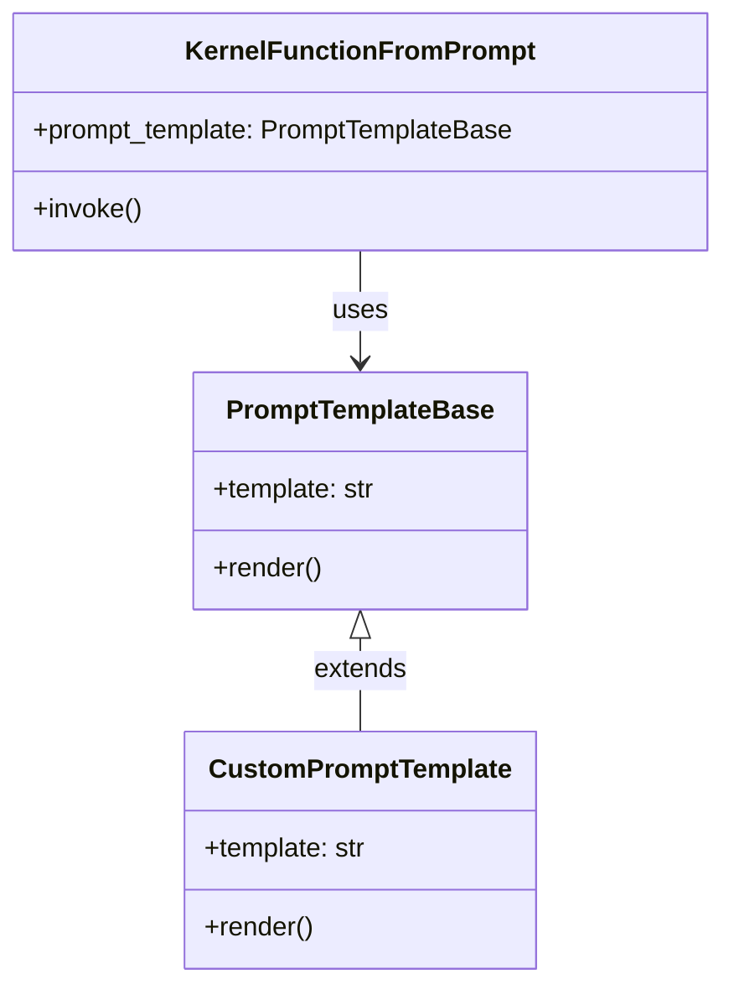

# Semantic Kernel Python: Extension Points

## Introduction

Semantic Kernel Python is designed with extensibility as a core principle. This document outlines the key extension points in the architecture, providing developers with a guide to customizing and extending the framework to meet specific needs.

## Plugin Architecture

The plugin system is the primary mechanism for extending Semantic Kernel's functionality.

### Creating Custom Plugins

A plugin is a collection of related functions that can be registered with the Kernel. There are two main approaches to creating plugins:

#### Method 1: Class-based Plugins

```python
class MathPlugin:
    """Plugin that provides math operations."""
    
    def add(self, a: float, b: float) -> float:
        """Add two numbers.
        
        Args:
            a: First number
            b: Second number
            
        Returns:
            The sum of a and b
        """
        return a + b
    
    def subtract(self, a: float, b: float) -> float:
        """Subtract b from a.
        
        Args:
            a: First number
            b: Second number
            
        Returns:
            The difference between a and b
        """
        return a - b

# Registration
kernel = Kernel()
kernel.add_plugin(MathPlugin(), "math")
```

#### Method 2: Function Decorators

```python
import semantic_kernel as sk
from semantic_kernel.functions import kernel_function

kernel = sk.Kernel()

@kernel_function(description="Add two numbers")
def add(a: float, b: float) -> float:
    """Add two numbers.
    
    Args:
        a: First number
        b: Second number
        
    Returns:
        The sum of a and b
    """
    return a + b

kernel.add_plugin(add, "math")
```

### Plugin Extension Point Diagram



## Custom AI Services

Semantic Kernel allows integration with various AI services through a set of well-defined interfaces.

### Text Completion Services

To create a custom text completion service:

```python
from semantic_kernel.connectors.ai import TextCompletionClientBase
from semantic_kernel.connectors.ai.prompt_execution_settings import PromptExecutionSettings

class CustomTextCompletionService(TextCompletionClientBase):
    """Custom text completion service."""
    
    async def complete(self, prompt: str, settings: PromptExecutionSettings) -> str:
        """Generate a text completion for the given prompt.
        
        Args:
            prompt: The prompt to complete
            settings: Execution settings
            
        Returns:
            The generated completion
        """
        # Implement your custom text completion logic here
        pass
    
    async def complete_stream(self, prompt: str, settings: PromptExecutionSettings) -> AsyncGenerator[str, None]:
        """Generate a streaming text completion for the given prompt.
        
        Args:
            prompt: The prompt to complete
            settings: Execution settings
            
        Yields:
            Chunks of the generated completion
        """
        # Implement your custom streaming text completion logic here
        pass

# Registration
kernel.add_service("custom_text_completion", CustomTextCompletionService())
```

### Chat Completion Services

To create a custom chat completion service:

```python
from semantic_kernel.connectors.ai import ChatCompletionClientBase
from semantic_kernel.contents import ChatHistory

class CustomChatCompletionService(ChatCompletionClientBase):
    """Custom chat completion service."""
    
    async def complete_chat(self, chat_history: ChatHistory, settings: PromptExecutionSettings) -> str:
        """Generate a chat completion for the given chat history.
        
        Args:
            chat_history: The conversation history
            settings: Execution settings
            
        Returns:
            The generated chat completion
        """
        # Implement your custom chat completion logic here
        pass
    
    async def complete_chat_stream(self, chat_history: ChatHistory, settings: PromptExecutionSettings) -> AsyncGenerator[str, None]:
        """Generate a streaming chat completion for the given chat history.
        
        Args:
            chat_history: The conversation history
            settings: Execution settings
            
        Yields:
            Chunks of the generated chat completion
        """
        # Implement your custom streaming chat completion logic here
        pass

# Registration
kernel.add_service("custom_chat_completion", CustomChatCompletionService())
```

### Embedding Services

To create a custom embedding service:

```python
from semantic_kernel.connectors.ai import EmbeddingGeneratorBase
import numpy as np

class CustomEmbeddingService(EmbeddingGeneratorBase):
    """Custom embedding service."""
    
    async def generate_embeddings(self, texts: List[str], settings: PromptExecutionSettings) -> List[List[float]]:
        """Generate embeddings for the given texts.
        
        Args:
            texts: The texts to generate embeddings for
            settings: Execution settings
            
        Returns:
            The generated embeddings
        """
        # Implement your custom embedding logic here
        pass

# Registration
kernel.add_service("custom_embedding", CustomEmbeddingService())
```

### AI Services Extension Point Diagram



## Custom Memory Connectors

Semantic Kernel can be extended to work with different vector databases through the `MemoryStore` interface.

### Creating a Custom Memory Store

```python
from semantic_kernel.memory import MemoryStore
from semantic_kernel.memory.memory_record import MemoryRecord

class CustomMemoryStore(MemoryStore):
    """Custom memory store implementation."""
    
    async def create_collection(self, collection_name: str) -> None:
        """Create a new collection.
        
        Args:
            collection_name: Name of the collection to create
        """
        # Implement collection creation logic
        pass
    
    async def get_collections(self) -> List[str]:
        """Get all collection names.
        
        Returns:
            List of collection names
        """
        # Return list of collections
        pass
    
    async def delete_collection(self, collection_name: str) -> None:
        """Delete a collection.
        
        Args:
            collection_name: Name of the collection to delete
        """
        # Implement collection deletion logic
        pass
    
    async def upsert(self, collection_name: str, record: MemoryRecord) -> str:
        """Add or update a record in the collection.
        
        Args:
            collection_name: Name of the collection
            record: Memory record to store
            
        Returns:
            The record ID
        """
        # Implement record upsert logic
        pass
    
    async def get(self, collection_name: str, key: str) -> Optional[MemoryRecord]:
        """Get a record from the collection.
        
        Args:
            collection_name: Name of the collection
            key: Record ID
            
        Returns:
            The memory record if found, None otherwise
        """
        # Implement record retrieval logic
        pass
    
    async def remove(self, collection_name: str, key: str) -> None:
        """Remove a record from the collection.
        
        Args:
            collection_name: Name of the collection
            key: Record ID
        """
        # Implement record removal logic
        pass
    
    async def search(
        self, 
        collection_name: str, 
        embedding: List[float], 
        limit: int = 10, 
        min_relevance_score: float = 0.7,
    ) -> List[Tuple[MemoryRecord, float]]:
        """Search for records similar to the embedding.
        
        Args:
            collection_name: Name of the collection
            embedding: Query embedding
            limit: Maximum number of results
            min_relevance_score: Minimum relevance score
            
        Returns:
            List of tuples containing memory records and their similarity scores
        """
        # Implement vector search logic
        pass

# Usage
memory_store = CustomMemoryStore()
semantic_text_memory = SemanticTextMemory(memory_store, embedding_generator)
kernel.register_memory_store(memory_store)
```

### Memory Extension Point Diagram



## Custom Planners

Planners orchestrate function execution to achieve complex goals. Semantic Kernel allows creating custom planners.

### Creating a Custom Planner

```python
from semantic_kernel.planners import PlannerBase
from semantic_kernel.functions import KernelFunction
from semantic_kernel.planning import Plan

class CustomPlanner(PlannerBase):
    """Custom planner implementation."""
    
    async def create_plan(self, goal: str, kernel: Kernel) -> Plan:
        """Create a plan to achieve the goal.
        
        Args:
            goal: The goal to achieve
            kernel: The kernel instance
            
        Returns:
            A plan to achieve the goal
        """
        # Get available functions
        available_functions = kernel.get_list_of_function_metadata()
        
        # Implement custom planning logic
        # ...
        
        # Create plan steps
        steps = [
            # Plan steps with functions and arguments
        ]
        
        # Create and return the plan
        return Plan(goal=goal, steps=steps)

# Usage
planner = CustomPlanner()
plan = await planner.create_plan("Analyze sentiment of the latest news about AI", kernel)
result = await plan.execute(kernel)
```

### Planner Extension Point Diagram



## Filter Pipeline

Semantic Kernel uses a filter pipeline pattern to intercept and modify function execution at various points.

### Creating Custom Filters

```python
from semantic_kernel.filters.kernel_filter import KernelFilter
from semantic_kernel.functions.kernel_arguments import KernelArguments

class LoggingFilter(KernelFilter):
    """Filter that logs function invocations."""
    
    async def on_function_invocation(
        self, 
        function_name: str, 
        arguments: KernelArguments, 
        next_filter: Callable,
    ) -> FunctionResult:
        """Called when a function is invoked.
        
        Args:
            function_name: The name of the function being invoked
            arguments: The arguments for the function
            next_filter: The next filter in the chain
            
        Returns:
            The function result
        """
        print(f"Invoking function: {function_name}")
        print(f"Arguments: {arguments}")
        
        # Call the next filter in the chain
        result = await next_filter(function_name, arguments)
        
        print(f"Function result: {result.value}")
        return result
    
    async def on_prompt_rendering(
        self, 
        prompt: str, 
        arguments: KernelArguments, 
        next_filter: Callable,
    ) -> str:
        """Called when a prompt is being rendered.
        
        Args:
            prompt: The prompt template
            arguments: The arguments for rendering
            next_filter: The next filter in the chain
            
        Returns:
            The rendered prompt
        """
        print(f"Rendering prompt: {prompt[:50]}...")
        
        # Call the next filter in the chain
        rendered_prompt = await next_filter(prompt, arguments)
        
        print(f"Rendered prompt: {rendered_prompt[:50]}...")
        return rendered_prompt

# Registration
kernel.add_filter(LoggingFilter(), FilterTypes.FUNCTION_INVOCATION)
kernel.add_filter(LoggingFilter(), FilterTypes.PROMPT_RENDERING)
```

### Filter Extension Point Diagram



## Template Engine

The template engine processes prompt templates and can be extended with custom variable handlers.

### Creating Custom Template Formats

```python
from semantic_kernel.prompt_template import PromptTemplateBase
from semantic_kernel.functions.kernel_arguments import KernelArguments

class CustomPromptTemplate(PromptTemplateBase):
    """Custom prompt template implementation."""
    
    def __init__(self, template: str):
        """Initialize the custom prompt template.
        
        Args:
            template: The template string
        """
        self.template = template
    
    async def render(self, arguments: KernelArguments) -> str:
        """Render the template with the given arguments.
        
        Args:
            arguments: The arguments for rendering
            
        Returns:
            The rendered template
        """
        # Implement custom template rendering logic
        rendered = self.template
        for key, value in arguments.items():
            placeholder = f"{{{{${key}}}}}"
            rendered = rendered.replace(placeholder, str(value))
        return rendered

# Usage
template = CustomPromptTemplate("Hello {{$name}}!")
rendered = await template.render(KernelArguments(name="world"))
```

### Template Engine Extension Point Diagram



## Integration Patterns

Semantic Kernel can be integrated with other systems using several patterns:

### Pattern 1: Embedding in Applications

```python
import semantic_kernel as sk
from semantic_kernel.connectors.ai.open_ai import OpenAIChatCompletion, OpenAITextEmbedding

async def main():
    # Initialize the kernel
    kernel = sk.Kernel()
    
    # Add AI services
    kernel.add_service(
        OpenAIChatCompletion(
            "chat-gpt",
            api_key="your-api-key",
            org_id="your-org-id"
        )
    )
    
    kernel.add_service(
        OpenAITextEmbedding(
            "text-embedding-ada-002",
            api_key="your-api-key",
            org_id="your-org-id"
        )
    )
    
    # Add plugins
    kernel.add_plugin(TimePlugin(), "time")
    kernel.add_plugin(MathPlugin(), "math")
    
    # Use in application
    result = await kernel.invoke("time", "now")
    print(f"Current time: {result}")
```

### Pattern 2: Exposing as a Service

```python
import semantic_kernel as sk
from fastapi import FastAPI, HTTPException
from pydantic import BaseModel

class ChatRequest(BaseModel):
    message: str

app = FastAPI()
kernel = sk.Kernel()

# Initialize kernel with services and plugins
# ...

@app.post("/chat")
async def chat(request: ChatRequest):
    try:
        result = await kernel.invoke_prompt(
            prompt="{{$input}}",
            plugin_name="chat",
            function_name="reply",
            arguments=sk.KernelArguments(input=request.message)
        )
        return {"response": result.value}
    except Exception as e:
        raise HTTPException(status_code=500, detail=str(e))
```

### Pattern 3: Using with MCP (Microsoft AI Copilot Platform)

```python
import semantic_kernel as sk

# Initialize kernel with services and plugins
kernel = sk.Kernel()
# ...

# Create MCP server from kernel
server = kernel.as_mcp_server(
    server_name="My SK Server",
    version="1.0.0",
    instructions="You are a helpful assistant that uses the Semantic Kernel to process requests."
)

# Run the server
if __name__ == "__main__":
    server.run()
```

## Conclusion

Semantic Kernel Python provides a rich set of extension points that enable developers to customize and extend the framework to meet their specific needs. By understanding these extension points, developers can:

1. Create custom plugins to encapsulate domain-specific functionality
2. Integrate with custom AI services beyond the built-in providers
3. Connect to specialized vector databases for memory storage
4. Implement custom planning strategies for complex workflows
5. Add cross-cutting concerns through the filter pipeline
6. Create custom prompt template formats
7. Integrate Semantic Kernel into various application architectures

These extension points are designed to be simple to use while providing maximum flexibility, making Semantic Kernel Python a powerful framework for AI application development.