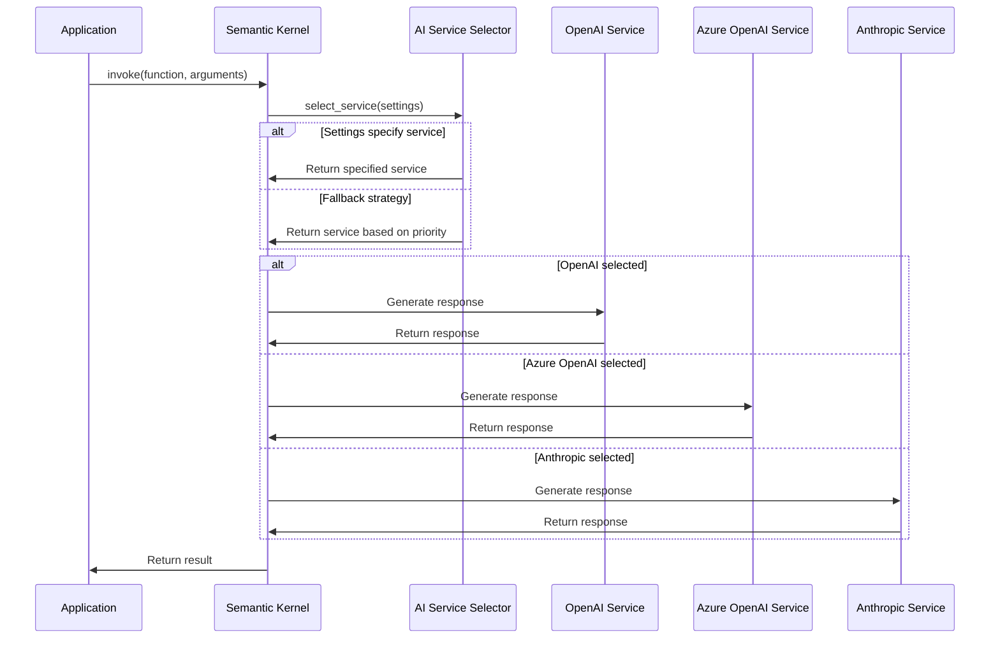
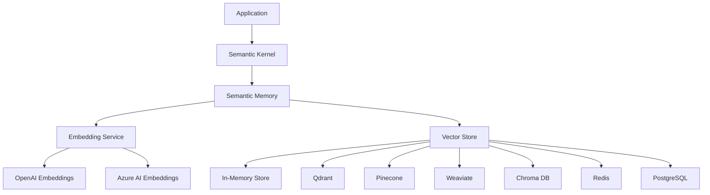
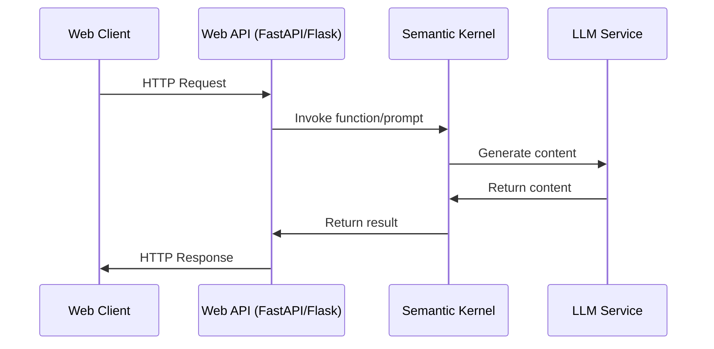
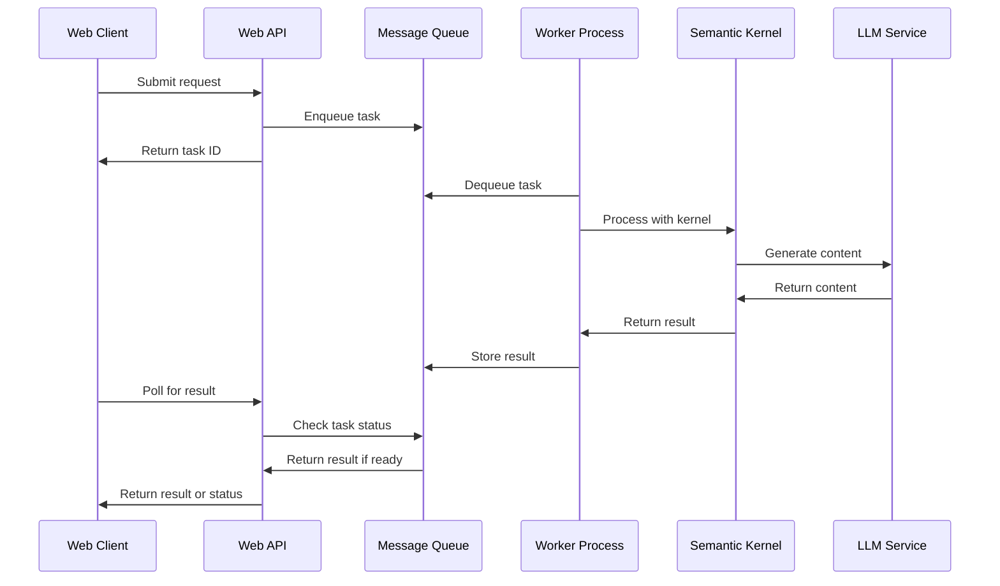
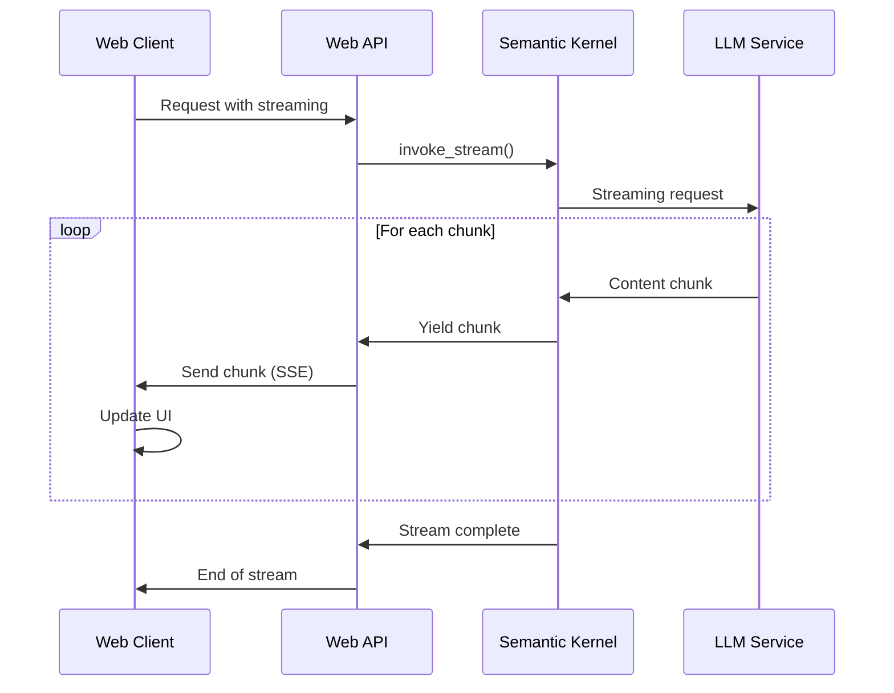
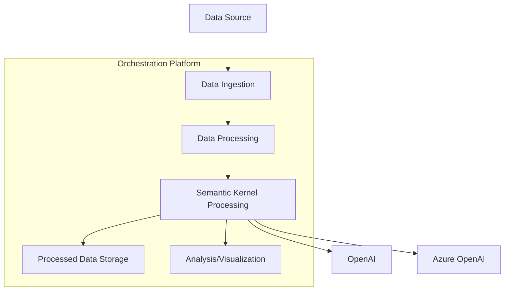
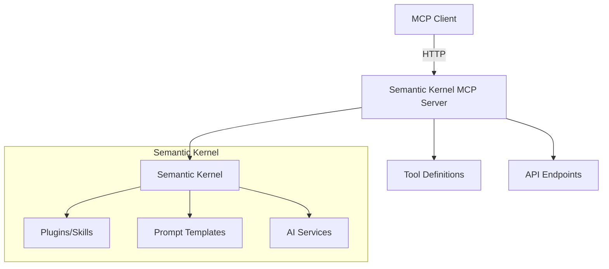
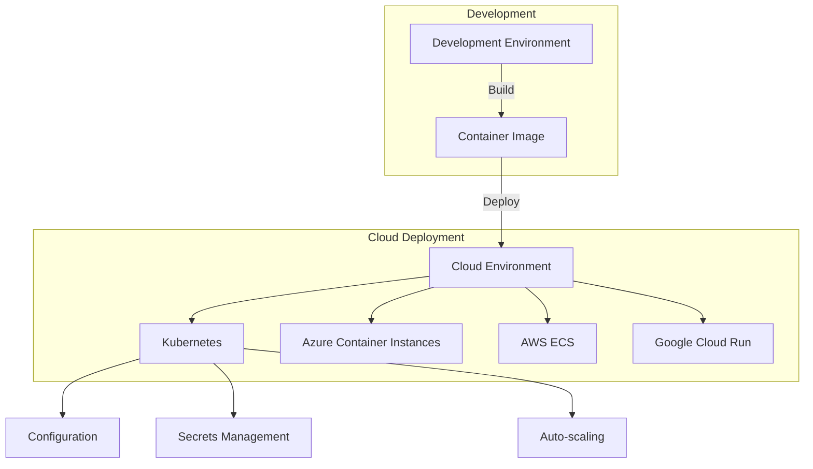

# Semantic Kernel Python: Integration Patterns

## Introduction

This document outlines common integration patterns for incorporating Semantic Kernel Python into applications and systems. These patterns demonstrate how to effectively combine Semantic Kernel with various AI models, frameworks, and architectures.

## LLM Integration Patterns

Semantic Kernel is designed to work with multiple Large Language Model (LLM) providers. The following patterns demonstrate how to integrate with popular LLM services.

### OpenAI Integration

```python
import semantic_kernel as sk
from semantic_kernel.connectors.ai.open_ai import OpenAIChatCompletion, OpenAITextEmbedding

kernel = sk.Kernel()

# Add OpenAI chat service
kernel.add_service(
    OpenAIChatCompletion(
        service_id="chat-gpt",
        model_id="gpt-4o",
        api_key="your-openai-api-key"
    )
)

# Add OpenAI embedding service
kernel.add_service(
    OpenAITextEmbedding(
        service_id="text-embedding-ada",
        model_id="text-embedding-3-large",
        api_key="your-openai-api-key"
    )
)

# Use with execution settings
settings = {
    "chat-gpt": {
        "temperature": 0.7,
        "top_p": 0.8,
        "max_tokens": 2000
    }
}

result = await kernel.invoke_prompt(
    prompt="Explain quantum computing simply.",
    execution_settings=settings
)
```

### Azure OpenAI Integration

```python
import semantic_kernel as sk
from semantic_kernel.connectors.ai.open_ai import (
    AzureOpenAIChatCompletion,
    AzureOpenAITextEmbedding
)

kernel = sk.Kernel()

# Add Azure OpenAI chat service
kernel.add_service(
    AzureOpenAIChatCompletion(
        service_id="azure-chat",
        deployment_name="your-deployment-name",
        endpoint="https://your-resource-name.openai.azure.com/",
        api_key="your-azure-api-key"
    )
)

# Add Azure OpenAI embedding service
kernel.add_service(
    AzureOpenAITextEmbedding(
        service_id="azure-embeddings",
        deployment_name="your-embedding-deployment",
        endpoint="https://your-resource-name.openai.azure.com/",
        api_key="your-azure-api-key"
    )
)
```

### Anthropic Integration

```python
import semantic_kernel as sk
from semantic_kernel.connectors.ai.anthropic import AnthropicChatCompletion

kernel = sk.Kernel()

# Add Anthropic chat service
kernel.add_service(
    AnthropicChatCompletion(
        service_id="claude",
        api_key="your-anthropic-api-key"
    )
)

# Use the Anthropic service
settings = {
    "claude": {
        "temperature": 0.5,
        "max_tokens": 1000
    }
}

result = await kernel.invoke_prompt(
    prompt="Write a short story about a robot learning to paint.",
    execution_settings=settings
)
```

### Multi-Model Integration Pattern



## Memory Integration Patterns

Semantic Kernel can be integrated with various vector databases for semantic memory capabilities.

### In-Memory Vector Store

```python
import semantic_kernel as sk
from semantic_kernel.memory import VolatileMemoryStore
from semantic_kernel.connectors.ai.open_ai import OpenAITextEmbedding

# Create memory components
memory_store = VolatileMemoryStore()
embedding_generator = OpenAITextEmbedding(
    service_id="ada-002",
    model_id="text-embedding-3-small",
    api_key="your-openai-api-key"
)

# Set up semantic memory
kernel = sk.Kernel()
kernel.add_service(embedding_generator)
kernel.register_memory_store(memory_store)

# Create a memory collection
await kernel.memory.create_collection("documents")

# Save information to memory
await kernel.memory.save_information(
    collection="documents",
    id="doc1",
    text="Semantic Kernel is a framework for integrating AI services with conventional programming languages.",
    description="SK Overview"
)

# Query the memory
results = await kernel.memory.search(
    collection="documents",
    query="What is Semantic Kernel?",
    limit=5
)
```

### Persistent Vector Database (Qdrant)

```python
import semantic_kernel as sk
from semantic_kernel.connectors.memory.qdrant import QdrantMemoryStore
from semantic_kernel.connectors.ai.open_ai import OpenAITextEmbedding

# Create memory components
memory_store = QdrantMemoryStore(url="http://localhost:6333")
embedding_generator = OpenAITextEmbedding(
    service_id="ada-002",
    model_id="text-embedding-3-small",
    api_key="your-openai-api-key"
)

# Set up semantic memory
kernel = sk.Kernel()
kernel.add_service(embedding_generator)
kernel.register_memory_store(memory_store)

# Use memory as before
await kernel.memory.create_collection("documents")
# ... save and search operations
```

### Memory Integration Pattern Diagram



## Web Framework Integration

Semantic Kernel can be integrated with popular Python web frameworks to create AI-powered web applications and APIs.

### FastAPI Integration

```python
import semantic_kernel as sk
from fastapi import FastAPI, HTTPException, BackgroundTasks
from pydantic import BaseModel
from semantic_kernel.connectors.ai.open_ai import OpenAIChatCompletion

# Create FastAPI app
app = FastAPI(title="Semantic Kernel API")

# Initialize Semantic Kernel
kernel = sk.Kernel()
kernel.add_service(
    OpenAIChatCompletion(
        service_id="chat-gpt",
        model_id="gpt-4o",
        api_key="your-openai-api-key"
    )
)

# Define request models
class ChatRequest(BaseModel):
    message: str
    conversation_id: str = None

class ChatResponse(BaseModel):
    response: str
    conversation_id: str

# Create an endpoint
@app.post("/chat", response_model=ChatResponse)
async def chat(request: ChatRequest):
    try:
        # Get or create chat history
        conversation_id = request.conversation_id or str(uuid.uuid4())
        
        # Process with Semantic Kernel
        result = await kernel.invoke_prompt(
            prompt="{{$input}}",
            arguments=sk.KernelArguments(input=request.message)
        )
        
        return ChatResponse(
            response=str(result),
            conversation_id=conversation_id
        )
    except Exception as e:
        raise HTTPException(status_code=500, detail=str(e))

# Run with: uvicorn app:app --reload
```

### Flask Integration

```python
import semantic_kernel as sk
from flask import Flask, request, jsonify
from semantic_kernel.connectors.ai.open_ai import OpenAIChatCompletion

# Create Flask app
app = Flask(__name__)

# Initialize Semantic Kernel
kernel = sk.Kernel()
kernel.add_service(
    OpenAIChatCompletion(
        service_id="chat-gpt",
        model_id="gpt-4o",
        api_key="your-openai-api-key"
    )
)

@app.route("/chat", methods=["POST"])
async def chat():
    data = request.json
    message = data.get("message")
    
    if not message:
        return jsonify({"error": "Message is required"}), 400
    
    try:
        result = await kernel.invoke_prompt(
            prompt="{{$input}}",
            arguments=sk.KernelArguments(input=message)
        )
        
        return jsonify({"response": str(result)})
    except Exception as e:
        return jsonify({"error": str(e)}), 500

# Run with: flask run
```

### Web Framework Integration Pattern



## Asynchronous Processing Integration

Semantic Kernel can be integrated with asynchronous processing systems for handling long-running AI tasks.

### Celery Integration

```python
import semantic_kernel as sk
from celery import Celery

# Create Celery app
celery_app = Celery(
    "semantic_kernel_tasks",
    broker="redis://localhost:6379/0",
    backend="redis://localhost:6379/0"
)

# Define task
@celery_app.task
def process_with_semantic_kernel(prompt, args):
    # Create kernel instance
    kernel = sk.Kernel()
    # ... add services and plugins
    
    # Use kernel to process
    result = kernel.invoke_prompt(
        prompt=prompt,
        arguments=sk.KernelArguments(**args)
    )
    
    return str(result)

# In your web application
@app.route("/process", methods=["POST"])
def process():
    data = request.json
    
    # Submit task to Celery
    task = process_with_semantic_kernel.delay(
        data["prompt"],
        data["arguments"]
    )
    
    return jsonify({"task_id": task.id})

@app.route("/result/<task_id>", methods=["GET"])
def get_result(task_id):
    task = process_with_semantic_kernel.AsyncResult(task_id)
    
    if task.ready():
        return jsonify({"result": task.get(), "status": "completed"})
    else:
        return jsonify({"status": "processing"})
```

### Asynchronous Processing Pattern



## Streaming Integration

Semantic Kernel supports streaming responses, which can be integrated with streaming-capable web frameworks.

### FastAPI with Server-Sent Events (SSE)

```python
import semantic_kernel as sk
from fastapi import FastAPI, Request, HTTPException
from fastapi.responses import StreamingResponse
from semantic_kernel.connectors.ai.open_ai import OpenAIChatCompletion

app = FastAPI()

# Initialize kernel
kernel = sk.Kernel()
kernel.add_service(
    OpenAIChatCompletion(
        service_id="chat-gpt",
        model_id="gpt-4o",
        api_key="your-openai-api-key"
    )
)

async def stream_generator(message: str):
    try:
        async for chunk in kernel.invoke_prompt_stream(
            prompt="{{$input}}",
            arguments=sk.KernelArguments(input=message)
        ):
            if hasattr(chunk, "content"):
                yield f"data: {chunk.content}\n\n"
            elif isinstance(chunk, str):
                yield f"data: {chunk}\n\n"
    except Exception as e:
        yield f"data: ERROR: {str(e)}\n\n"
    
    yield "data: [DONE]\n\n"

@app.post("/chat/stream")
async def chat_stream(request: Request):
    data = await request.json()
    message = data.get("message")
    
    if not message:
        raise HTTPException(status_code=400, detail="Message is required")
    
    return StreamingResponse(
        stream_generator(message),
        media_type="text/event-stream"
    )
```

### Streaming Integration Pattern



## Data Processing Integration

Semantic Kernel can be integrated with data processing pipelines to enhance data with AI capabilities.

### Integration with Data Engineering Tools

```python
import semantic_kernel as sk
import pandas as pd
from semantic_kernel.connectors.ai.open_ai import OpenAIChatCompletion

# Initialize kernel
kernel = sk.Kernel()
kernel.add_service(
    OpenAIChatCompletion(
        service_id="chat-gpt",
        model_id="gpt-3.5-turbo",
        api_key="your-openai-api-key"
    )
)

# Load data
df = pd.read_csv("customer_feedback.csv")

# Define sentiment analysis function
prompt_template = """
Analyze the sentiment of the following customer feedback. 
Provide a score from 1-5 (1 being very negative, 5 being very positive) 
and a brief explanation of your reasoning.

Customer feedback: {{$input}}

Output in format:
Score: [1-5]
Reason: [brief explanation]
"""

# Process data
results = []

for feedback in df["feedback"]:
    result = await kernel.invoke_prompt(
        prompt=prompt_template,
        arguments=sk.KernelArguments(input=feedback)
    )
    
    # Parse result (example implementation)
    result_text = str(result)
    score_line = result_text.split("\n")[0]
    score = int(score_line.split(":")[1].strip())
    
    results.append({"feedback": feedback, "sentiment_score": score})

# Create result dataframe
result_df = pd.DataFrame(results)
```

### Integration with Apache Airflow

```python
import semantic_kernel as sk
from airflow import DAG
from airflow.operators.python import PythonOperator
from datetime import datetime, timedelta

default_args = {
    'owner': 'airflow',
    'depends_on_past': False,
    'start_date': datetime(2023, 1, 1),
    'email_on_failure': False,
    'retries': 1,
    'retry_delay': timedelta(minutes=5),
}

dag = DAG(
    'semantic_kernel_processing',
    default_args=default_args,
    description='Process data with Semantic Kernel',
    schedule_interval=timedelta(days=1),
)

def process_with_sk(**context):
    # Initialize Semantic Kernel
    kernel = sk.Kernel()
    # ... add services and plugins
    
    # Get data from previous task or parameter
    data = context['params'].get('data', [])
    
    # Process with Semantic Kernel
    results = []
    for item in data:
        result = kernel.invoke_prompt(
            prompt="Analyze the following: {{$input}}",
            arguments=sk.KernelArguments(input=item)
        )
        results.append(str(result))
    
    # Pass results to the next task
    context['ti'].xcom_push(key='sk_results', value=results)
    
    return results

process_task = PythonOperator(
    task_id='process_with_semantic_kernel',
    python_callable=process_with_sk,
    params={
        'data': ['sample data 1', 'sample data 2']
    },
    dag=dag,
)
```

### Data Processing Integration Pattern



## MCP (Microsoft AI Copilot Platform) Integration

Semantic Kernel Python can be configured as an MCP server to integrate with other MCP-compatible clients.

### MCP Server Configuration

```python
import semantic_kernel as sk
from semantic_kernel.connectors.ai.open_ai import OpenAIChatCompletion
from semantic_kernel.prompt_template.kernel_prompt_template import KernelPromptTemplate

# Create and configure the kernel
kernel = sk.Kernel()
kernel.add_service(
    OpenAIChatCompletion(
        service_id="gpt-4",
        model_id="gpt-4o",
        api_key="your-openai-api-key"
    )
)

# Add plugins (skills) to the kernel
# ... add plugins ...

# Create prompt templates
weather_template = KernelPromptTemplate(
    template="Provide a weather forecast for {{$location}}."
)

travel_template = KernelPromptTemplate(
    template="Suggest itinerary for a 3-day trip to {{$destination}}."
)

# Create MCP server
server = kernel.as_mcp_server(
    prompts=[weather_template, travel_template],
    server_name="Semantic Kernel MCP Server",
    version="1.0.0",
    instructions="""You are a helpful assistant that can provide weather 
    forecasts and travel recommendations.""",
)

# Run the server
if __name__ == "__main__":
    server.run(host="0.0.0.0", port=8000)
```

### MCP Integration Pattern



## Containerization and Deployment

Semantic Kernel applications can be containerized and deployed to various environments.

### Docker Configuration

```dockerfile
# Use Python base image
FROM python:3.10-slim

# Set working directory
WORKDIR /app

# Copy requirements
COPY requirements.txt .

# Install dependencies
RUN pip install --no-cache-dir -r requirements.txt

# Copy application code
COPY . .

# Expose port
EXPOSE 8000

# Command to run the application
CMD ["python", "app.py"]
```

Example requirements.txt:
```
semantic-kernel==1.29.0
openai==1.40.0
fastapi==0.110.0
uvicorn==0.28.0
python-dotenv==1.0.1
```

### Kubernetes Deployment

```yaml
apiVersion: apps/v1
kind: Deployment
metadata:
  name: semantic-kernel-app
spec:
  replicas: 3
  selector:
    matchLabels:
      app: semantic-kernel-app
  template:
    metadata:
      labels:
        app: semantic-kernel-app
    spec:
      containers:
      - name: semantic-kernel-app
        image: semantic-kernel-app:latest
        ports:
        - containerPort: 8000
        env:
        - name: OPENAI_API_KEY
          valueFrom:
            secretKeyRef:
              name: ai-secrets
              key: openai-api-key
        resources:
          limits:
            cpu: "1"
            memory: "2Gi"
          requests:
            cpu: "500m"
            memory: "1Gi"
---
apiVersion: v1
kind: Service
metadata:
  name: semantic-kernel-service
spec:
  selector:
    app: semantic-kernel-app
  ports:
  - port: 80
    targetPort: 8000
  type: LoadBalancer
```

### Deployment Pattern



## Conclusion

Semantic Kernel Python can be integrated into a wide variety of systems and architectures using these patterns. The flexibility of the framework allows it to be used in:

1. **Web Applications**: Using frameworks like FastAPI and Flask
2. **Data Processing Pipelines**: With tools like Pandas and Apache Airflow
3. **Streaming Applications**: For real-time AI processing
4. **Containerized Deployments**: For scalable, cloud-native applications
5. **Tool Providers**: As an MCP server for copilot platforms

By leveraging these integration patterns, developers can incorporate AI capabilities into their applications while maintaining clean architectural boundaries and separation of concerns.