# Semantic Kernel Python: Architecture Overview

## Introduction

Semantic Kernel is an open-source framework designed to integrate Large Language Models (LLMs) with conventional programming languages. The Python implementation of Semantic Kernel provides a structured approach to building AI-powered applications by combining the capabilities of LLMs with traditional software development patterns.

This document provides a high-level overview of the Semantic Kernel Python architecture, its core concepts, and the key components that constitute the framework.

## Core Concepts

Semantic Kernel Python is built around several fundamental concepts:

### Kernel

The `Kernel` class serves as the central orchestrator and main entry point for the Semantic Kernel framework. It manages:

- Plugins and functions registration
- AI service connections
- Function invocation
- Memory services
- Function invocation pipeline with filters

The Kernel follows a modular design pattern, allowing components to be added, replaced, or extended as needed.

### Functions

Functions are the basic unit of execution in Semantic Kernel. There are two primary types:

1. **Native Functions**: Traditional Python functions that can be registered with the Kernel.
2. **Semantic Functions**: Prompt-based functions that use LLMs to generate responses.

Functions are organized into plugins (collections of related functions) and can be invoked through the Kernel.

### Plugins

Plugins are collections of related functions that can be registered with the Kernel. They provide a way to organize functionality and can be:

- Core plugins (built into the framework)
- Custom plugins (created by developers)
- Imported plugins (from external sources)

### Memory

Semantic Kernel provides a memory system for storing and retrieving information. The memory system includes:

- Embedding generation for semantic search
- Vector storage backends
- Memory operation abstractions

### Planning

Planners in Semantic Kernel help orchestrate function execution based on user goals. They can:

- Break down complex tasks
- Determine which functions to call
- Control the execution flow
- Handle results and errors

### Connectors

Connectors provide integration with external services and technologies:

- AI service connectors (OpenAI, Azure OpenAI, Anthropic, Google, etc.)
- Memory connectors (various vector databases)
- Search connectors

## Architectural Principles

Semantic Kernel Python follows these key architectural principles:

### 1. Modularity

The framework is designed with highly cohesive and loosely coupled modules that can be used independently or combined as needed.

### 2. Extensibility

Semantic Kernel is built to be extended through:
- Custom plugins
- Custom AI service connectors
- Custom planners
- Custom memory connectors

### 3. Abstraction

The framework provides abstractions over complex AI capabilities, allowing developers to focus on application logic rather than AI implementation details.

### 4. Composition

Functions can be composed together to create more complex behaviors, either manually or through planners.

### 5. Prompt Engineering as Code

Semantic Kernel treats prompts as code, with support for:
- Template variables
- Context-aware prompt construction
- Prompt management

## System Boundaries

Semantic Kernel Python interfaces with several external systems:

### External AI Services

- OpenAI (GPT models)
- Azure OpenAI Service
- Anthropic (Claude models)
- Google AI (Gemini models)
- Hugging Face models
- Mistral AI
- Ollama
- NVIDIA AI

### Vector Databases

- In-memory storage
- Qdrant
- Pinecone
- Weaviate
- Chroma
- Milvus
- Azure AI Search
- PostgreSQL
- Redis
- MongoDB Atlas
- Azure Cosmos DB

### External Systems

- Search engines (Bing, Google)
- OpenAPI-based services
- Custom API integrations

## High-Level Architecture Diagram

```mermaid
graph TD
    Kernel[Kernel\nOrchestration Center] --> FunctionSystem[Function System]
    Kernel --> MemorySystem[Memory System]
    Kernel --> PlanningSystem[Planning System]
    
    %% Function System
    subgraph FunctionSystemBox[Function System]
        NativeFunctions[Native Functions]
        SemanticFunctions[Semantic Functions]
        Plugins[Plugins]
        
        NativeFunctions --> Plugins
        SemanticFunctions --> Plugins
    end
    
    %% Memory System
    subgraph MemorySystemBox[Memory System]
        MemoryStorage[Memory Storage]
        VectorDBs[Vector DBs]
        Embeddings[Embeddings]
        
        MemoryStorage --> VectorDBs
    end
    
    %% Planning System
    subgraph PlanningSystemBox[Planning System]
        SequentialPlanner[Sequential Planner]
        StepwisePlanner[Stepwise Planner]
        CustomPlanners[Custom Planners]
    end
    
    %% Bottom layer systems
    FunctionSystem --> AIServiceLayer[AI Service Layer]
    MemorySystem --> TemplateEngine[Template Engine]
    PlanningSystem --> ContentSystem[Content System]
    
    %% AI Service Layer
    subgraph AIServiceLayerBox[AI Service Layer]
        AIConnectors[AI Connectors]
        AIProviders[OpenAI, Azure, Anthropic, etc.]
        
        AIConnectors --> AIProviders
    end
    
    %% Template Engine
    subgraph TemplateEngineBox[Template Engine]
        TemplateParsing[Template Parsing]
        VariableResolution[Variable Resolution]
    end
    
    %% Content System
    subgraph ContentSystemBox[Content System]
        ChatMessages[Chat Messages]
        ContentHandling[Content Handling]
    end
    
    %% Style definitions
    classDef kernel fill:#f9f,stroke:#333,stroke-width:2px
    classDef system fill:#bbf,stroke:#333,stroke-width:1px
    classDef subsystem fill:#ddf,stroke:#333,stroke-width:1px
    
    class Kernel kernel
    class FunctionSystem,MemorySystem,PlanningSystem,AIServiceLayer,TemplateEngine,ContentSystem system
    class NativeFunctions,SemanticFunctions,Plugins,MemoryStorage,VectorDBs,Embeddings,SequentialPlanner,StepwisePlanner,CustomPlanners,AIConnectors,AIProviders,TemplateParsing,VariableResolution,ChatMessages,ContentHandling subsystem
```

This diagram illustrates the high-level architecture of Semantic Kernel Python, showing the main components and their relationships.

## Key Dependencies

Semantic Kernel Python relies on several key dependencies:

1. **AI Service SDKs**: OpenAI, Azure OpenAI, Anthropic, etc.
2. **Vector Database Clients**: Various clients for different vector databases
3. **Core Python Libraries**: asyncio, typing, json, etc.
4. **Templating Engines**: For prompt templates processing

## Deployment Model

Semantic Kernel Python can be deployed in various configurations:

1. **Embedded**: Integrated directly into Python applications
2. **Service**: As a separate service accessed via API
3. **Serverless**: In serverless functions (AWS Lambda, Azure Functions)
4. **Containerized**: In Docker containers
5. **MCP Server**: As a Microsoft AI Copilot Platform server

## Conclusion

Semantic Kernel Python provides a comprehensive framework for integrating AI capabilities into applications. Its modular architecture, extensibility, and abstraction of complex AI operations make it a powerful tool for developers looking to build AI-enhanced applications.

The following sections will dive deeper into specific components, their interactions, data flows, and extension points.